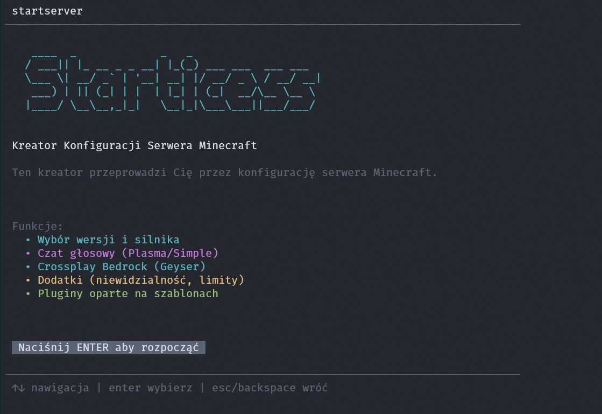

# StartServer

Kreator konfiguracji serwera Minecraft w terminalu



## Co to jest

StartServer to narzedzie ktore pomaga ci ustawic serwer Minecraft krok po kroku bez wiedzy technicznej Wybierasz co chcesz i gotowe

## Instalacja

Otworz terminal i wpisz

```
npm install -g @zimetuer/startserver
```

Musisz miec zainstalowany Node.js w wersji 18 lub nowszej Pobierz go z nodejs.org

## Jak uzyc

Po instalacji wpisz w terminalu

```
startserver
```

Albo uruchom bez instalacji

```
npx @zimetuer/startserver
```

Pojawi sie kreator w terminalu gdzie wybierasz opcje strzalkami

## Sterowanie

- Strzalki gora dol - poruszanie sie po liscie
- Strzalki lewo prawo - zmiana wartosci
- Enter - zatwierdzanie wyboru
- ESC albo Backspace - cofanie

## Co mozna ustawic

- Wersja Minecraft od 1.8 w gore
- Silnik serwera Paper Purpur i inne
- Szablon serwera Minimalny Standardowy albo Pelny z gotowymi pluginami
- Czat glosowy PlasmaVoice albo Simple Voice Chat
- Crossplay Bedrock dzieki Geyser i Floodgate gracze z telefonow i konsol moga dobic na serwer
- Rozne dodatki jak ochrona spawna RTP domy blokada combat log ekonomia granica swiata i wiecej
- Wybor pluginow z listy 15 popularnych pluginow
- Konfiguracja server properties ilosc RAM granica swiata

## Plugin ServerAdditions

StartServer automatycznie kopiuje wbudowany plugin ServerAdditions do folderu plugins na serwerze Plugin dziala na Paper i Spigot 1.20+ i dodaje przydatne funkcje ktore mozna wlaczyc lub wylaczyc w config.yml

### Co oferuje plugin

- System Lifesteal - zdobadz serca za zabojstwo strac przy smierci
- Ostatni Krzyk - 5 sekund ratunku przy 0 HP zanim umrzesz
- Zlote Jablka - lecza wiecej im wyzszy poziom
- Teleportacja - /rtp /spawn /home /sethome /tpa /warp
- Narzedzia - /seen /invsee /ec /wb /balance /pay
- Serca - /hearts withdraw i /hearts deposit do wplacania i wyplacania serc
- Wszystkie funkcje mozna wlaczyc lub wylaczyc w config.yml

### Komendy

| Komenda | Co robi |
|---------|---------|
| /hearts | Status serc i poziomu |
| /hearts withdraw | Wyplac serce |
| /hearts deposit | Wplac serce |
| /rtp | Losowy teleport |
| /spawn | Teleport na spawn |
| /home | Teleport do domu |
| /sethome | Ustaw dom |
| /tpa | Prosba o teleport |
| /warp | Teleport do warpu |
| /seen | Kiedy gracz byl online |
| /invsee | Podglad ekwipunku |
| /ec | Otworz enderchest |
| /wb | Stol rzemieslniczy |
| /balance | Stan konta |
| /pay | Przelew |
| /sa reload | Przeladuj config admin |

### Uprawnienia

- serveradditions.admin - komendy admina
- serveradditions.rtp - teleportacja losowa
- serveradditions.home - dom
- serveradditions.tpa - prosba o teleport
- serveradditions.warp - warpy
- serveradditions.hearts - serca

## Wymagania

- Nodejs 18 lub nowszy
- Java 17 lub nowsza do uruchomienia serwera Minecraft

## Licencja

MIT